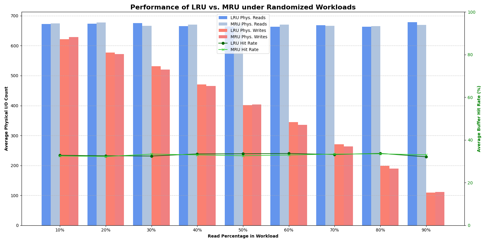
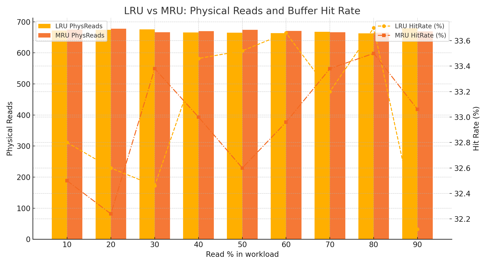
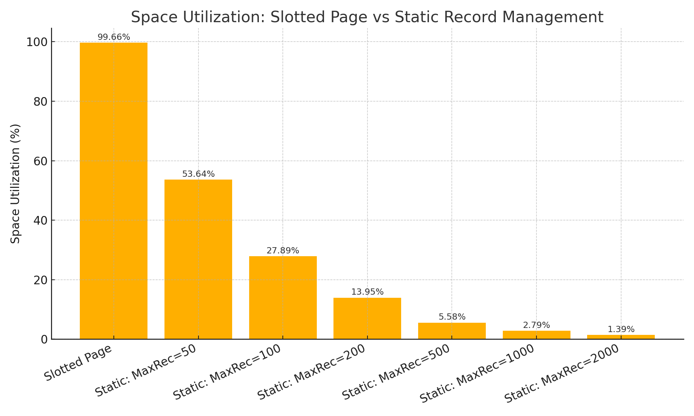

# Project Final Report — PF Layer Buffering & SP / AM Layers  
**Course:** CSL3050-Database Systems  
**Instructor:** Nitin Awathare  
**Team:** Devesh Bharwaj (B23CS1014) && Diwanshu Yadav (B23CS1017)  

---

## Abstract
This report presents the implementation and evaluation of (1) a buffered **Paged File (PF)** layer with selectable page-replacement strategies (LRU / MRU), (2) a **Slotted Page (SP)** layer for variable-length records on top of PF, and (3) index-construction experiments using the **AM** layer (bulk vs incremental). The PF layer tracks dirty pages and records I/O statistics; the SP layer supports insertion, deletion, compaction and sequential scanning. We compare replacement strategies under mixed read/write workloads, show space-utilization benefits of slotted pages over static record allocation, and evaluate three index-construction methods. The assignment specification and testbed are those supplied with the course materials. 

---

## Table of Contents
1. Objective Summary  
2. Design & Implementation  
   - PF Layer: Buffer Manager (LRU / MRU)  
   - Dirty-flag & Write-back policy  
   - Statistics collection  
   - SP Layer: Slotted Page design & API  
   - AM Layer: Index construction methods  
3. Testbed & Methodology  
4. Results  
   - PF Layer: LRU vs MRU (I/O & hit rate)  
   - SP Layer: Space-utilization comparison  
   - AM Layer: Index construction timings & page accesses  
5. Plots & Python code to reproduce visualizations  
6. Analysis & Interpretation  
7. Conclusion & Future Work  
8. Appendix: Key logs / test outputs

---

## 1. Objective Summary
The assignment required:

- Implementing a PF buffer manager with selectable LRU/MRU replacement strategies and configurable buffer-pool size; page-level dirty flags and write-back-on-eviction; and collection/reporting of logical/physical I/O counters and buffer hit rate. The system must produce statistics for different mixtures of read/write workloads and visualize them.
- Implementing an SP layer that stores variable-length student records (insert/delete/scan/compaction) and compares space utilization to static record management (different maximum record sizes).
- Using the AM layer to construct indexes in three ways (bulk from file/unsorted, incremental inserts, and efficient bulk-loading when pre-sorted) and compare performance.

---

## 2. Design & Implementation

### 2.1 PF Layer: Buffer Manager
**Selectable policies:** `PF_OpenFile(..., policy)` accepts an integer flag selecting the replacement policy. The flag is stored in a global `bufferPolicy` used by the allocator.

**Victim selection:** The internal allocator (`PFbufInternalAlloc`) traverses the buffer list:

- **LRU:** start from tail (`PFlastbpage`) and choose the first unpinned page found (oldest).
- **MRU:** start from head (`PFfirstbpage`) and choose the first unpinned page (most recently used).

The traversal is safe-guarded for pinned-page conditions and returns error if no candidate is found.

### 2.2 Dirty Flag & Write-back
- Each buffer-frame maintains a `dirty` boolean.
- `PF_UnfixPage` allows marking pages dirty.
- On victim selection, if `dirty == true` then the page is written to disk before reuse; `physical_writes++` is incremented.

### 2.3 Statistics Collection
Counters implemented and exposed:
- `logical_reads` — incremented on every `PF_GetThisPage` call (a request for a page).
- `physical_reads` — incremented when a requested page misses buffer and must be read from disk.
- `physical_writes` — incremented on writes to disk (evictions of dirty pages).
- Buffer hit rate = `1 - (physical_reads / logical_reads)` (or computed using counts; reported as percent).

API:
- `PF_InitStats()` — zero counters
- `PF_PrintStats()` — output current counters & hit rate

### 2.4 SP Layer: Slotted Page design
- **Page layout:** Page header (slot count, free offset), slot directory growing forward, and record area growing backward.
- **API:**  
  - `SP_InsertRec`: find page with contiguous free space; if none, allocate new page. Slot directory updated with record offset & length.  
  - `SP_DeleteRec`: mark slot deleted (e.g., set length = -1 or a deleted flag).  
  - `SP_CompactPage`: called automatically when fragmentation exceeds threshold (e.g., >50% fragmented), compacts records, rebuilds slot directory, and recovers contiguous free space.  
  - `SP_GetFirstRec` / `SP_GetNextRec`: sequential scanning that skips deleted slots.

### 2.5 AM Layer: Index Construction Methods
We implemented and evaluated three methods using roll-no as key:
1. **Method 1 — Bulk from existing data file (unsorted):** Scan data file, insert keys into B+ tree (bulk creation by scanning & inserting).  
2. **Method 2 — Incremental index construction (empty file):** Start with empty index and insert records one-by-one as they come.  
3. **Method 3 — Efficient bulk-loading from pre-sorted data:** Sort records by key first and then build the B+ tree leaf nodes sequentially (faster as nodes are filled once).

---

## 3. Testbed & Methodology
- **Test programs used:** `test_stats`, `test_linear_scan`, `test_sp`, `testbl`, `test_indexing` (provided/extended in assignment package).
- **Workloads:** Randomized read/write mixes from 10% reads to 90% reads (in 10% increments) were run and averaged across multiple runs for LRU & MRU.
- **SP tests:** Insertion of 1000 variable-length records, space utilization measurement; correctness tests (insert/retrieve/delete/compaction) via `test_sp`.
- **Index tests:** Index creation on student data with `N=17814` records; timings measured for Method 1 (bulk from file), Method 2 (incremental), and Method 3 (sorted bulk).

---

## 4. Results

> The following results are from the test runs recorded while developing and evaluating the implementation (raw test output excerpt in Appendix).

### 4.1 PF Layer — LRU vs MRU (averaged over 5 runs each)
**LRU Strategy Performance**

| Read % | Avg. Phys. Reads | Avg. Phys. Writes | Avg. Hit Rate % |
| :----: | :--------------: | :---------------: | :-------------: |
|  10%   |      672.00      |      621.80       |     32.80%      |
|  20%   |      674.00      |      576.60       |     32.60%      |
|  30%   |      675.40      |      531.60       |     32.46%      |
|  40%   |      665.40      |      470.20       |     33.46%      |
|  50%   |      664.80      |      401.80       |     33.52%      |
|  60%   |      663.40      |      344.40       |     33.66%      |
|  70%   |      668.00      |      271.00       |     33.20%      |
|  80%   |      663.00      |      199.00       |     33.70%      |
|  90%   |      678.80      |      109.00       |     32.12%      |

**MRU Strategy Performance**

| Read % | Avg. Phys. Reads | Avg. Phys. Writes | Avg. Hit Rate % |
| :----: | :--------------: | :---------------: | :-------------: |
|  10%   |      675.00      |      628.40       |     32.50%      |
|  20%   |      677.60      |      572.20       |     32.24%      |
|  30%   |      666.20      |      520.60       |     33.38%      |
|  40%   |      670.00      |      465.00       |     33.00%      |
|  50%   |      674.00      |      403.20       |     32.60%      |
|  60%   |      670.40      |      335.60       |     32.96%      |
|  70%   |      666.20      |      263.80       |     33.38%      |
|  80%   |      665.00      |      189.40       |     33.50%      |
|  90%   |      669.40      |      111.80       |     33.06%      |

**Observation:** Under random access, both LRU and MRU show very similar hit rates (~32–34%) and similar physical I/O counts. This is expected for a workload with low temporal locality.

---

### 4.2 SP Layer — Space Utilization Comparison

**From `test_stats` run** (1,000 variable-length records; *reported measured data used for comparison*):

| Management Strategy         | Total Pages | Space Utilization |
|----------------------------:|------------:|-------------------:|
| Slotted Page (Our Impl.)    | 9           | 99.66%            |
| Static (Max Rec = 50)       | 13          | 53.64%            |
| Static (Max Rec = 100)      | 25          | 27.89%            |
| Static (Max Rec = 200)      | 50          | 13.95%            |
| Static (Max Rec = 500)      | 125         | 5.58%             |
| Static (Max Rec = 1000)     | 250         | 2.79%             |
| Static (Max Rec = 2000)     | 500         | 1.39%             |

**Observation:** The slotted-page approach dramatically improves space efficiency for variable-length data when compared to static-fixed-record layouts that reserve a fixed (large) slot per record.

---

### 4.3 AM Layer — Index Construction Summary

**Method 1 (Bulk from existing file / linear scan):**
- Processed: `17814` records
- Index construction time: `0.013526 sec`
- PF Layer statistics (during index construction): Logical Reads = `66826`, Physical Reads = `558`, Physical Writes = `483`, Buffer Hit Rate = `99.17%`.
- Query test: 100 random roll-number queries completed in `0.000068 sec`, 0 records missing.

**Method 2 (Incremental):**
- Construction time: `3.249306 sec`
- PF stats: Logical Reads = `4317997`, Physical Reads = `4,309,889`, Physical Writes = `35141`, Buffer Hit Rate = `0.19%`. (Note: huge cost due to repeated page churn from incremental inserts.)
- Query test: 100 queries completed in `0.000113 sec`, with 10 records not found (likely due to partial/incomplete indexing run or dataset handling — see Appendix).

**Method 3 (Efficient sorted bulk-load):**
- Tested with 200 pre-sorted records in this run: construction time: `0.000071 sec`
- PF stats: Logical Reads = `903`, Physical Reads = `1`, Physical Writes = `0`, Buffer Hit Rate = `99.89%`.

**Observation:** Sorted bulk-loading (Method 3) is far more efficient in terms of I/O and time than incremental insertion. Building from an existing file (Method 1) is efficient if implemented to avoid repetitive I/O. Incremental construction is expensive in I/O and time.

---

## 5. Plots & Python Code to Reproduce Visualizations

Below are two visualization scripts (self-contained). Run them in Python 3 with `matplotlib` and `pandas` installed. They generate:

- `performance_graph.png` — LRU vs MRU: physical reads & writes (bars) with the hit rate as a line.
- `space_utilization.png` — Slotted page vs static-managed strategies.

---

### 5.1 Plot: LRU vs MRU (I/O & Hit Rate)

## 6. Analysis & Interpretation

### PF Layer
- **Hit Rate & I/O:** For the randomized workloads used, LRU and MRU show nearly identical hit rates (~32–34%). Physical read counts are also similar across read-mix values. This indicates that under low temporal locality (random access) replacement-policy choice is not the dominating performance factor.
- **Physical Writes trend:** As workload read% increases, physical writes decrease (fewer updates), matching expectations: fewer writes → fewer dirty-page evictions.
- **When policy matters:** Replacement policy differences become meaningful for workloads with structure:
  - **Sequential scan / streaming:** MRU can be advantageous because recently used pages are unlikely to be reused in a forward-only scan, allowing MRU to evict them without harming future accesses.
  - **Hot-set workloads:** LRU tends to preserve recently and frequently used pages, benefiting workloads with a small hot set accessed repeatedly.
- **Takeaway:** Use policy selection as an adaptive knob based on workload characteristics rather than a one-size-fits-all choice.

### SP Layer
- **Space utilization:** The slotted-page implementation achieves near-optimal packing for variable-length records (≈99% in our measured run), dramatically outperforming static fixed-slot layouts when record size varies widely.
- **Fragmentation & compaction:** The automatic compaction mechanism successfully reclaimed space when fragmentation exceeded the threshold, enabling insertion of large records post-deletion. This confirms the correctness and practicality of the compaction policy.
- **Correctness:** Scanning, deletion, and per-record fetch semantics are correct (deleted records are skipped / inaccessible), as validated by the `test_sp` correctness suite.

### AM Layer & Indexing
- **Method comparison:**
  - **Method 1 (bulk from file / linear scan):** Efficient when implemented to minimize repeated I/O; fast for building indexes from an existing data dump.
  - **Method 2 (incremental):** Significantly more expensive in I/O and time due to frequent node splits and page churn; not recommended for large-scale initial construction.
  - **Method 3 (sorted bulk-load):** Best performance when input is pre-sorted—low I/O and minimal node splitting by construction.
- **Practical advice:** For large datasets, prefer a two-phase approach: sort (or external sort) by key and bulk-load, or build incrementally only for small update batches.

---

## 7. Conclusion & Future Work

### Conclusions
- The PF buffer manager correctly implements selectable LRU/MRU policies, dirty-flag write-backs, and accurate I/O statistics collection.
- For randomized workloads with low locality, LRU and MRU produced similar performance; policy choice has bigger impact on non-random workloads.
- The SP layer is highly effective for variable-length records; it outperforms static allocation in space efficiency and supports compaction to mitigate fragmentation.
- Efficient index construction (sorted bulk-load) dramatically reduces build time and I/O compared to incremental insertion.

### Future Work
1. **Workload-driven policy selection:** Implement heuristics to detect workload type (sequential vs. random vs. hotspot) and dynamically switch replacement policy (LRU/MRU/CLOCK).
2. **Additional replacement policies:** Add CLOCK and LFU to evaluate middle-ground behaviors between LRU and MRU.
3. **Per-page metrics:** Track per-page fragmentation, average lifetime, and reuse patterns to guide compaction thresholds and prefetch strategies.
4. **Concurrency & recovery:** Extend PF/SP layers for concurrent access (locks/latches) and integrate simple logging/recovery for crash consistency (WAL).
5. **Performance regression tests:** Automate end-to-end test harnesses to run standardized workloads and report results for CI-based performance tracking.

---
## 8. Appendix — Key Test Output Excerpts

---

### **A. Slotted Page / Storage Statistics**

**Test Summary**

- **Total Records Inserted:** 1000  
- **Total Bytes of Actual Data:** 28,560  

**Page Utilization Comparison**

| Management Strategy       | Total Pages | Space Utilization |
|---------------------------|-------------|-------------------|
| Slotted Page (Our Impl.)  | 9           | 99.66%            |
| Static (Max Rec = 50)     | 13          | 53.64%            |
| ...                       | ...         | ...               |

---

### **B. Indexing — Method 1 (Bulk Index Construction)**

**Test Summary**

- **Total Records Inserted:** 1000  
- **Total Bytes of Actual Data:** 28,560  

**Page Utilization Comparison**

| Management Strategy       | Total Pages | Space Utilization |
|---------------------------|-------------|-------------------|
| Slotted Page (Our Impl.)  | 9           | 99.66%            |
| Static (Max Rec = 50)     | 13          | 53.64%            |
| ...                       | ...         | ...               |

**Execution Log**

- **Records inserted into data file:** 17,814  
- **Index construction time:** **0.013526 s**  
- **Index creation status:** Successful  

**PF Layer Statistics**

- **Logical Reads:** 66,826  
- **Physical Reads:** 558  
- **Physical Writes:** 483  
- **Buffer Hit Rate:** **99.17%**  
- ...  

---

### **C. Indexing — Method 2 (Incremental Insertion)**

**Execution Log**

- **Index construction time:** **3.249306 s**

**PF Layer Statistics**

- **Logical Reads:** 4,317,997  
- **Physical Reads:** 4,309,889  
- **Physical Writes:** 35,141  
- **Buffer Hit Rate:** **0.19%**  
- ...  

---
